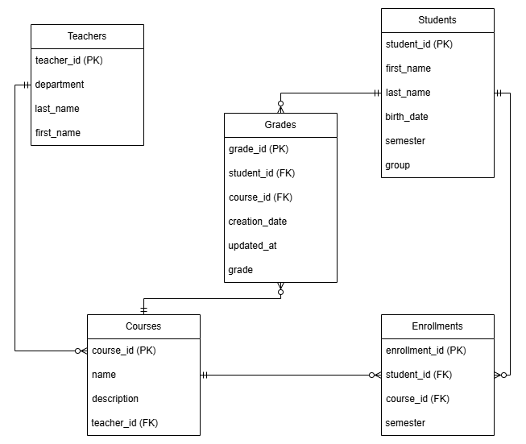

# Проект SQL-базы данных для образовательной организации

##### ***Цель работы:***
Разработка и реализация базы данных для управления информацией о студентах, преподавателях, курсах, зачислениях и оценках. Основная цель — создание эффективной базы данных для отслеживания и анализа образовательных процессов.

--------

#### ***Описание проекта:***

Проект представляет собой систему для управления данными студентов, преподавателей, курсов, зачислений и оценок в образовательной организации. Проект охватывает основные операции, такие как добавление, удаление, обновление и извлечение информации о студентах, преподавателях и курсах. Он также включает механизмы для обработки оценок студентов и анализа образовательных процессов.

----------

#### ***Предметная область и сущности:***

Сущности:

* 1. **Студенты** — информация о студентах, включая имя, фамилию, дату рождения, группу и текущий семестр.
* 2. **Преподаватели** — информация о преподавателях, включая имя, фамилию и кафедру.
* 3. **Курсы** — информация о курсах, которые преподаются в образовательной организации.
* 4. **Зачисления** — информация о том, какие студенты зачислены на какие курсы.
* 5. **Оценки** — информация о полученных оценках студентами по каждому курсу, а также даты и время создания/обновления этих данных.

----------

### ***Описание каждой сущности и их назначения в БД***

1. **Студенты** - сущность, содержащая информацию о каждом студенте. Атрибуты таблицы включают:
    - `student_id` — уникальный идентификатор студента
    - `first_name` — имя студента
    - `last_name` — фамилия студента
    - `birth_date` — дата рождения
    - `semester` — текущий семестр
    - `group` — учебная группа

2. **Преподаватели** - сущность, которая содержит информацию о преподавателях. Атрибуты таблицы включают:
    - `teacher_id` — уникальный идентификатор преподавателя
    - `first_name` — имя преподавателя
    - `last_name` — фамилия преподавателя
    - `department` — кафедра преподавателя

3. **Курсы** - сущность, которая содержит информацию о курсах. Атрибуты таблицы включают:
    - `course_id` — уникальный идентификатор курса
    - `name` — название курса
    - `description` — описание курса
    - `teacher_id` — ссылка на преподавателя, который ведет этот курс

4. **Зачисления** - сущность, которая связывает студентов с курсами. Атрибуты таблицы включают:
    - `enrollment_id` — уникальный идентификатор зачисления
    - `student_id` — ссылка на студента
    - `course_id` — ссылка на курс
    - `semester` — семестр, в котором студент был зачислен на курс

5. **Оценки** - сущность, которая хранит информацию о полученных оценках студентами. Атрибуты таблицы включают:
    - `grade_id` — уникальный идентификатор оценки
    - `student_id` — ссылка на студента
    - `course_id` — ссылка на курс
    - `grade` — оценка
    - `creation_date` — дата создания записи
    - `updated_at` — дата последнего обновления

----------

### ***Цель проекта:***

Создание базы данных для хранения информации о студентах, преподавателях, курсах, зачислениях и оценках. Система будет использоваться для управления образовательным процессом, предоставления информации о курсах и оценках, а также анализа учебных данных.

### ***Актуальность области***

Образовательный процесс требует эффективного управления данными студентов, преподавателей и курсов. Система баз данных позволяет централизованно хранить информацию и обеспечивать быстрый доступ к данным для анализа, отчетности и принятия решений. Система будет полезна для образовательных учреждений в организации и автоматизации учебного процесса.

----------

### ***Описание функционала запросов***
*Запросы пронумерованы для большего удобства.*

1. Найти всех студентов из группы `Б05-312`, отсортированных по фамилии в алфавитном порядке.

2. Отсортировать и вывести количество курсов, которые преподает каждый преподаватель.

3. Найти преподавателей, которые ведут больше 2 курсов.

4. Получить фамилии студентов из всех групп формата `Б05-3ху`, которые записаны на курс с названием "Математика".

5. Найти курсы, на которые записаны студенты из групп `Б05-311` и `Б05-320`.

6. Вывести топ-9 студентов с наибольшими оценками.

7. Найти среднюю оценку каждого студента по всем курсам.

8. Показать оценки студентов, а также предыдущую оценку для сравнения (по дате выставления).

9. Найти студентов из групп `Б05-311` и `Б05-324`, которые записаны хотя бы на один курс, преподаваемый Громовым.

10. Вывести 5 лучших оценок студентов из группы `Б05-313`, пропустив лучшую.